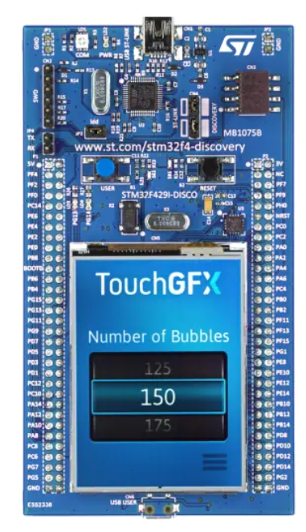

# Mastering Microcontroller STM32 LTDC LCD TFT LVGL
Microcontroller based embedded graphics system , Interfacing, and building graphical UI using LVGL

## Summary
Source code adapted after the Udemy.com course "Mastering Microcontroller: STM32-LTDC, LCD-TFT, LVGL (MCU3)".

https://www.udemy.com/course/mastering-microcontroller-stm32-ltdc-lcd-tft-lvgl/

The source code works on STM32F429I-DISC1.
* https://www.st.com/en/microcontrollers-microprocessors/stm32f429zi.html

Read more about from the LVGL Documentation
* https://docs.lvgl.io/master/index.html

### STM32 SF429I-DISC1

### Commits by
* George Calin
* george.calin [at] gmail.com
* Connect me on LinkedIn: https://www.linkedin.com/in/cgeorge1978/
